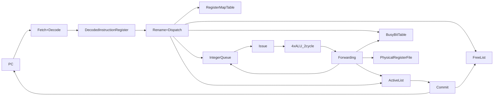
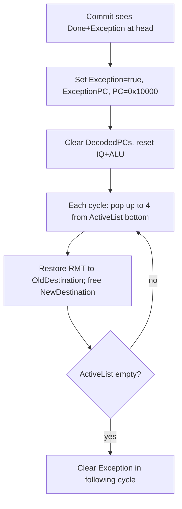

## CS-470 Homework 1 — OoO470 Cycle-Accurate Simulator (Rust)

This homework asks you to build a **cycle-exact simulator** of a small out-of-order (OoO) CPU called **OoO470**.
The simulator reads a program (JSON array of assembly strings), simulates the microarchitecture **cycle by cycle**, and outputs a JSON log of the machine state after every cycle.

This repository already includes a complete Rust implementation under `HW1/simulator/` plus the required `build.sh` / `run.sh` harness.

---

## Quickstart

From the `HW1/` directory:

```bash
./runall.sh
./testall.sh
```

### What these scripts do

| Script | Purpose | Output |
|---|---|---|
| `build.sh` | Compiles the Rust simulator | `HW1/simulator/target/release/simulator` |
| `run.sh <in> <out>` | Runs the simulator on a single test/program | Writes `<out>` (JSON log) |
| `runall.sh` | Runs `run.sh` on every folder in `given_tests/*` | Creates `given_tests/*/user_output.json` |
| `testall.sh` | Compares your generated logs vs the reference outputs | Prints `PASSED!` or the first mismatch |

### Run one test manually

```bash
./run.sh given_tests/03/input.json given_tests/03/user_output.json
python ./compare.py given_tests/03/user_output.json -r given_tests/03/output.json
```

---

## A gentle introduction to Out-of-Order execution

An **in-order** CPU must execute instructions strictly in program order: even if instruction 5 is ready, it cannot run before instruction 4.

An **out-of-order** CPU splits execution into phases so it can:
- **Rename registers** to eliminate false dependencies (WAW/WAR)
- **Queue** instructions until their *true* operands (RAW) are available
- **Issue** ready instructions to execution units as soon as resources are available
- Still **commit** (retire) in program order so the architectural state is correct and exceptions are precise

OoO470 is a simplified teaching design with:
- **Fetch+Decode width**: up to 4 instructions/cycle
- **Rename+Dispatch width**: up to 4 instructions/cycle
- **Issue width**: up to 4 instructions/cycle (oldest-first)
- **Execution**: 4 ALUs, fixed **2-cycle latency**
- **Commit width**: up to 4 instructions/cycle (in-order)

---

## Microarchitecture at a glance

### Pipeline blocks (conceptual)



### What “cycle-exact” means here

On every cycle, the simulator updates data structures exactly like the hardware:
- Some decisions use the **state as of the beginning of the cycle** (e.g., commit eligibility).
- Some structures support “same-cycle read-after-write” behavior (queues, forwarding, etc.).

If you get one ordering rule wrong, your JSON log diverges from the reference.

---

## Data structures (what they mean, what file they’re in)

The simulator’s “state” is intentionally close to the PDF. The table below maps each required JSON field to the Rust struct and meaning.

| JSON field | Rust field | Meaning |
|---|---|---|
| `PC` | `ProcessorState.pc` | Next instruction index to fetch (0..N-1). Set to `0x10000` in exception mode. |
| `PhysicalRegisterFile` | `ProcessorState.physical_register_file` | 64 physical 64-bit regs, initialized to 0. |
| `DecodedPCs` | `ProcessorState.decoded_pcs` | PCs currently sitting in the decode register (up to 4). |
| `Exception` | `ProcessorState.exception` | Exception mode flag (precise exceptions). |
| `ExceptionPC` | `ProcessorState.exception_pc` | PC of the instruction that triggered the exception. |
| `RegisterMapTable` | `ProcessorState.register_map_table` | Architectural→physical mapping for x0..x31. |
| `FreeList` | `ProcessorState.free_list` | FIFO of free physical registers (initially p32..p63). |
| `BusyBitTable` | `ProcessorState.busy_bit_table` | Whether a physical register’s value is still pending. |
| `ActiveList` | `ProcessorState.active_list` | In-flight instructions in program order (for commit + recovery). |
| `IntegerQueue` | `ProcessorState.integer_queue` | Waiting instructions (reservation-station-like). |

### Extra internal state (not logged)

| Internal field | Why it exists |
|---|---|
| `decoded_instructions` | We need full decoded info, not just PCs, to rename/dispatch. |
| `alu_pipeline` | Models the ALU 2-cycle latency (4 ALUs × 2 stages). |
| `exception_will_clear` | Matches “exception mode ends one cycle after ActiveList becomes empty”. |

---

## How one cycle works (step-by-step)

Everything happens in `HW1/simulator/src/pipeline.rs` in `propagate_one_cycle(...)`.

Think of each cycle as:
- **read current state**
- **compute decisions**
- **update state**

### Cycle order used by this simulator

| Step | Stage | Intuition |
|---:|---|---|
| 0 | Forwarding read | “Which ALU results mature this cycle?” |
| 1 | Commit | Retire up to 4 done instructions in-order; detect exceptions precisely. |
| 2 | Exception handling | If exception: stop fetch, clear decode, reset IQ+exec; later roll back younger ops. |
| 3 | Issue (select) | Pick up to 4 ready IQ entries (oldest PC first). |
| 4 | Rename+Dispatch | If resources allow, rename decoded ops and enqueue them to IQ+AL. |
| 5 | Fetch+Decode | If no backpressure, fetch up to 4 new instructions into decode reg. |
| 6 | Apply forwarding | Write PRF, clear busy bits, mark AL done, wake IQ operands (non-exception results). |
| 7 | Advance ALU pipeline | Shift the 2-cycle ALU “pipeline registers”, insert issued ops. |
| 8 | Remove issued IQ entries | Issued instructions leave IQ “next cycle” (modeled at end). |

Two subtle rules that matter a lot:
- **Issue selection happens this cycle, but removal from IQ happens for the next cycle** (so rename cannot assume IQ slots freed immediately).
- **Exception-producing results do not wake dependents** and do not clear their destination busy bit (until recovery/rollback).

---

## Precise exceptions & recovery (div-by-zero)

Only `divu` and `remu` can throw, when divisor is 0.

### Precise exception behavior (what the simulator enforces)

When the excepting instruction reaches the head of the Active List and is committed:
- `ExceptionPC` is set to its PC
- `Exception` becomes `true`
- `PC` is set to `0x10000`
- Fetch/decode stops and the decoded register is cleared
- IQ and execution pipeline are reset
- The machine rolls back younger in-flight instructions (from the bottom of Active List) **up to 4 per cycle**

### Recovery diagram



---

## Code structure (where to look for what)

| File | What to read it for |
|---|---|
| `HW1/simulator/src/main.rs` | Program entrypoint + logging loop |
| `HW1/simulator/src/parser.rs` | Parsing input JSON strings into `Instruction` |
| `HW1/simulator/src/types.rs` | Data models for instructions, IQ, AL, forwarding |
| `HW1/simulator/src/state.rs` | Full machine state + `snapshot()` JSON serialization |
| `HW1/simulator/src/pipeline.rs` | The cycle-accurate implementation of every stage |

---

## Debugging tips

### Use the visualizer

Open `HW1/visualize.html` and load any `output.json` (or `user_output.json`) to browse cycle-by-cycle state.

### When `compare.py` fails

It stops at the first mismatch. The most common causes:
- Stage ordering bug (commit vs rename, issue vs rename, forwarding timing)
- Busy-bit or operand-ready handling around exception-producing instructions
- IQ capacity semantics (issued entries should not free slots in the same cycle)

---

## Docker grading environment

The provided `Dockerfile` recreates the grading environment.
From `HW1/`:

```bash
sudo docker build . -t cs470
sudo docker run -it -v $(pwd):/home/root/cs470 cs470
cd /home/root/cs470
./runall.sh
./testall.sh
```


